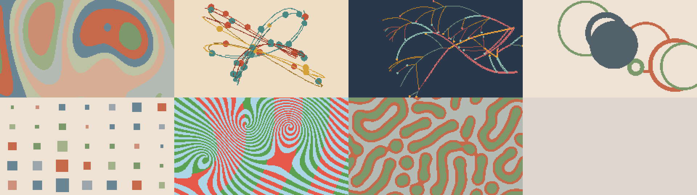
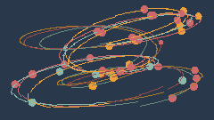
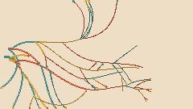
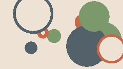
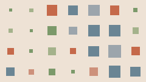

# Rill Synth

**rill** /rɪl/ *noun* — a small stream.

A generative synthesizer for the **M5Stack StickS3**. Seven voices compose delicate, evolving melodies with generative visuals. Tap for a new piece. Shake for a new visual. Sound and visuals run entirely on the device, without Wi-Fi or an account.

[Play Rill Synth](https://rillsound.com/synth) · [Build and install](#build-and-install)

**Rill family:** [Synth](https://github.com/bruceblay/rill-synth) · [Mallet](https://github.com/bruceblay/rill-mallet) · [World](https://github.com/bruceblay/rill-world) · [Drums](https://github.com/bruceblay/rill-drums) · [Rill Sound](https://rillsound.com)

## Visuals

These are captures from the current `visuals-study` renderer, driven by the Synth engine—not photographs of the device. [Development source](https://github.com/bruceblay/rill-synth/tree/visuals-study). Published firmware releases may show the earlier visual set.

| Contour | Pendulum |
| --- | --- |
|  |  |
| **Growth** | **Eclipse** |
|  |  |
| **Tiles** | **Reef** |
|  |  |

## Play

| Gesture | Action |
| --- | --- |
| Front button: tap | Generate a new musical piece, change the visual, and play |
| Front button: hold for about 0.65 seconds | Fade sound out or in; the composition continues while quiet |
| Side button: tap | Cycle volume and show the data view for four seconds |
| Shake | Immediately switch to a different visual family and composition |

The data view shows the voice, key, mode, generation number, tempo, delay rhythm, volume and battery estimate. New musical generations also select a new visual. Shake changes only the visual. The gesture uses two acceleration peaks and a short cooldown; a single tilt is not a shake.

## Sound

- **Seven timbres:** Bongo, Bars, Wood, Bells, Wire, Halo and Synth. These combine resonant modes, plucked tones, FM and filtered oscillators; they are interpretations, not exact hardware or acoustic-instrument emulations.
- **Generated phrases:** six contour tendencies guide newly composed melodies, variable phrase spans, interval preferences and rhythms. Ideas develop through changed endings, rhythmic rephrasing, recalled fragments and new descendants. Sparse answering parts follow their own timing. Twelve tonics, three modes, four harmonic behaviors and gradual changes in activity give each piece its own phrasing.
- **Evolving echoes:** two tempo-related taps, smooth or stepped feedback, occasional stronger repeat passages and intermittent smearing.
- **Visuals:** the current development set is shown above. This branch’s firmware and existing releases retain the earlier six-family renderer.

New music fades between generations. Generations are not saved across restarts. Device-to-device ensemble sync is a [design proposal](SYNC-DESIGN.md), not an available feature.

## Hardware

Supported and tested: **M5Stack StickS3**, with ESP32-S3, 8 MB flash, display, IMU and built-in speaker. Other ESP32 boards and earlier M5Stick models are not supported by this configuration.

The PlatformIO board name is `esp32-s3-devkitc-1`; the project supplies the StickS3 memory settings and uses M5Unified for board peripherals.

## Build and install

Install Python 3.11 or later, then run these commands from the repository root:

```sh
python3 -m venv .venv
source .venv/bin/activate
python -m pip install -r requirements-dev.txt
pio run
```

On Windows, activate with `.venv\Scripts\activate` instead. PlatformIO downloads the pinned platform and library dependencies on the first build.

Connect the StickS3 with a USB data cable, locate its port with `pio device list`, then install:

```sh
python tools/flash.py --port YOUR_DEVICE_PORT
```

Flashing replaces the firmware currently on the device. The script builds and uploads, then applies the watchdog reset used successfully during development; a normal RTS reset can leave this board in download mode.

To observe diagnostics:

```sh
pio device monitor --port YOUR_DEVICE_PORT --baud 115200
```

Close the monitor before another upload. If the device is not detected, check the cable and port permissions and consult the [StickS3 documentation](https://docs.m5stack.com/en/core/StickS3).

## Develop without hardware

Host tools use the same C++ synthesis and visual code as the firmware. A C++17 compiler is required.

```sh
python tools/test.py
mkdir -p build
c++ -std=c++17 -O2 tools/render.cpp -o build/render
build/render build/rill.wav 60 42 2
c++ -std=c++17 -O2 tools/visual_preview.cpp -o build/visual_preview
build/visual_preview build/preview.ppm 17 2
```

The audio arguments are output path, seconds, seed, and optional first voice (0–6). The visual arguments are output path, seed, and optional family (0–5). Audio output is mono 32 kHz / 16-bit WAV; visual output is PPM. For host address/undefined-behavior checks, run `python tools/test.py --sanitize` with a compatible compiler. Set `CXX` to choose a compiler.

Tests cover thirty simulated minutes of music, bounded output, key/register constraints, live transitions, reproducibility, all musical and visual families, shake detection, and retained historical behaviors. They do not replace listening or checking the physical screen.

## Project layout

- `src/Garden.h` — synthesis, score and effects
- `src/Light.h` — procedural visual families
- `src/main.cpp` — audio, display, buttons and motion tasks
- `src/ShakeDetector.h` — gesture recognition
- `tools/` — portable tests, auditions, previews and flashing
- `tests/` — host verification, with required historical baselines in `fixtures/`

See [publishing notes](docs/PUBLISHING.md), [changes](CHANGELOG.md), and [contributing](CONTRIBUTING.md).

## Credits and license

Created by Bruce Blay. Developed through iterative on-device listening and viewing, with Codex assisting implementation.

Brian Eno's generative work, Cyma Forma's RND synth, and Zach Lieberman's daily sketches helped inform the direction. Rill is an independent project, with no affiliation or endorsement implied. Device photos by Bruce Blay show Rill running on the hardware; no artwork by those artists is bundled.

Rill follows its parent project Pocket Radio's **GPL-3.0-or-later** license. See [LICENSE](LICENSE). Third-party components retain their own licenses; see [dependency notices](docs/DEPENDENCIES.md).
